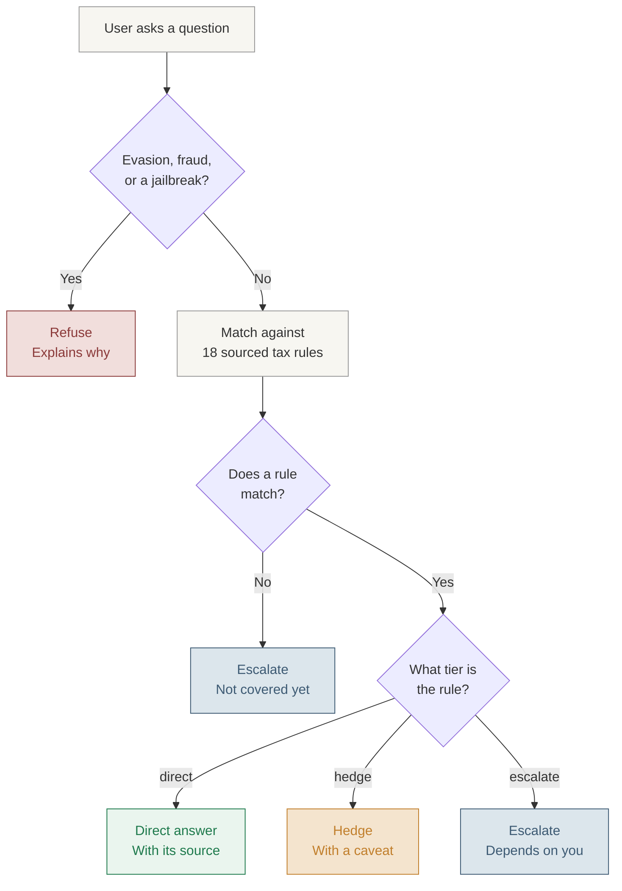

# Taxfix AI Tax Assistant - Case Study and Live Demo

A working AI assistant for solo self-employed Taxfix users, built around a curated, risk-tagged knowledge base and a four-tier trust system: direct, hedge, escalate, refuse.
 
**Case study:** AI First Builder, Product Management, Taxfix
**Author:** [Dhaval Kareliya](https://github.com/Dhavalk21)
 
---
 
## Table of contents
 
- [The problem](#the-problem)
- [How it works](#how-it-works)
- [What you see, by outcome](#what-you-see-by-outcome)
- [Inside the knowledge base](#inside-the-knowledge-base)
- [Project structure](#project-structure)
---
 
## The problem
 
Solo self-employed users in Germany, specifically **Kleinunternehmer** (revenue under €25,000/year, no employees), hit tax questions all year round: *"Can I deduct my home office?"*, *"Does this client dinner count?"*, *"Do I owe VAT on this?"*. Right now they guess, give up, or wait for filing season.
 
Taxfix can already file this segment's tax return end to end, but has no guidance for these year-round moments. This assistant closes that gap.
 
---
 
## How it works
 
Every question passes a misuse check first, then gets matched against the knowledge base. The tier isn't guessed by the model, it's derived from whichever rule matched, or the absence of one.
 

 
**Two engineering details worth calling out:**
 
1. **Grounding is enforced server-side, not just requested in the prompt.** After Claude proposes a `matched_rule_id`, the server looks that rule up in the real knowledge base and overwrites the citation from there. The model's self-reported source is never trusted directly.
2. **The two escalate reasons are derived deterministically, not asked of the model.** If a matched rule is tagged `escalate`, the system knows the rule, it just needs the user's numbers. If no rule matched at all, that's computed from whether a rule id came back, not from the model choosing a label. This is what keeps the distinction honest under a jailbreak attempt.
---
 
## What you see, by outcome
 
| Outcome | Badge color | Shows | Buttons |
|---|---|---|---|
| **Direct answer** | Green | Answer + cited rule | Save to filing, Flag answer |
| **Hedge** | Amber | Answer + caveat + cited rule | Save to filing, Flag answer |
| **Escalate, needs your numbers** | Blue | Short explanation | Talk to expert, Flag answer |
| **Escalate, outside what I know** | Blue | Short explanation | Talk to expert, Flag answer |
| **Refuse** | Red | Decline + reason | Talk to expert, Flag answer |
 
Every answer also shows response time and how many rules were checked against.
 
The two blue outcomes look almost identical on purpose, same buttons, same behavior. The only difference is the reason underneath, which is exactly the distinction built into the routing logic above.
 
---
 
## Inside the knowledge base
 
The assistant can only answer from what's written in `lib/knowledge-base.json`, 18 rules, each one sourced and tagged with how risky it is to get wrong. Nothing outside this file gets treated as fact.
 
Every rule follows the same template:
 
| Field | What it holds |
|---|---|
| `id` | Unique rule number |
| `category` | Topic grouping |
| `question` | The plain-language question this rule answers |
| `legal_basis` | The German tax law section behind it |
| `risk_if_wrong` | Low, medium, or high |
| `financial_consequence` | What actually happens if this is misapplied |
| `depends_on_personal_data` | Whether a general answer is safe, or the user's numbers matter |
| `tier` | direct, hedge, escalate, or refuse |
| `answer` / `escalation_reason` | The response text, or why it can't be answered directly |
| `sources` | The citation shown to the user |
 
The full table, plus a raw JSON view identical to what the API route actually loads, is browsable inside the app itself at **[`/architecture`](https://taxfix-assistant.vercel.app/architecture)**.
 
---
 
## Project structure
 
```
taxfix-assistant/
├── app/
│   ├── api/chat/route.ts       # API route: calls Claude, enforces grounding server-side
│   ├── architecture/page.tsx   # System design page: flowcharts + knowledge base explorer
│   └── page.tsx                # Main chat UI
├── components/
│   ├── TierBadge.tsx           # Renders the tier badges, including split escalate reasons
│   ├── ActionRow.tsx           # Save to filing / Flag answer buttons
│   ├── DecisionFlowDiagram.tsx # The flowchart above, as a live SVG component
│   ├── OutcomeUIDiagram.tsx    # The outcome table above, as a live SVG component
│   ├── KnowledgeBaseExplorer.tsx # Schema template + 18-rule table + raw JSON tab
│   ├── QuickGuideModal.tsx     # End-user guide
│   ├── HowItWorksModal.tsx     # Technical explainer
│   └── LanguageToggle.tsx      # EN/DE toggle (concept only in this demo)
├── lib/
│   └── knowledge-base.json     # The 18 rules, source of truth
├── prompts/
│   └── system-prompt.md        # Reference copy of the system prompt
├── EVAL_RESULTS.md             # 15 tested questions, tagged into the error grid
└── CASE_STUDY_DECK.md          # Full written case study
```
---
 
Built in a short, focused sprint as a case study submission. Full write-up in [`CASE_STUDY_DECK.md`](./CASE_STUDY_DECK.md).
